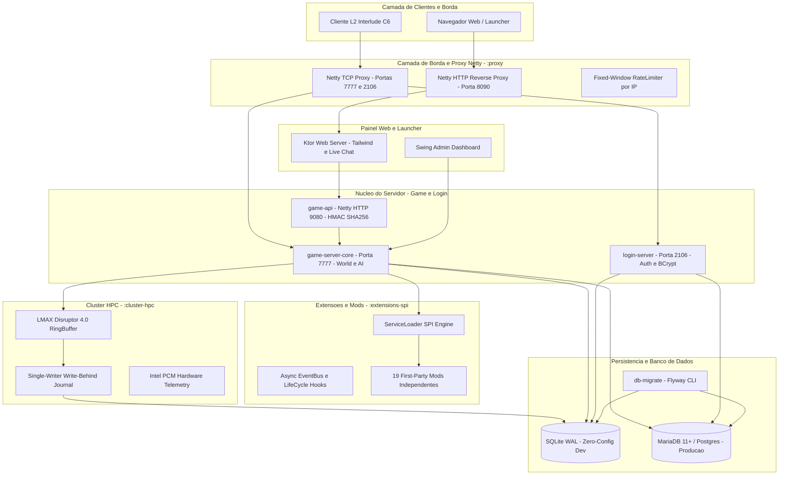
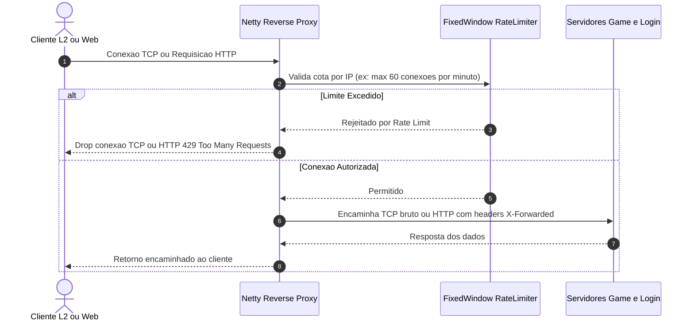
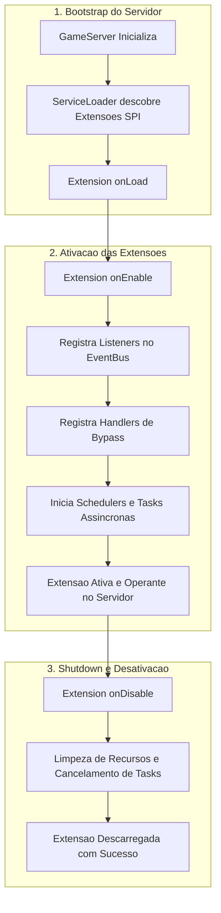
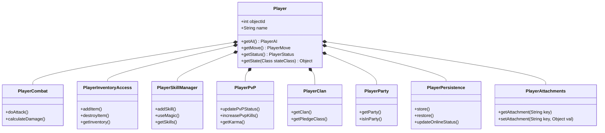
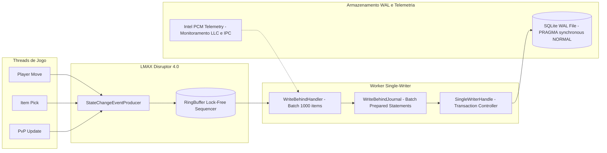
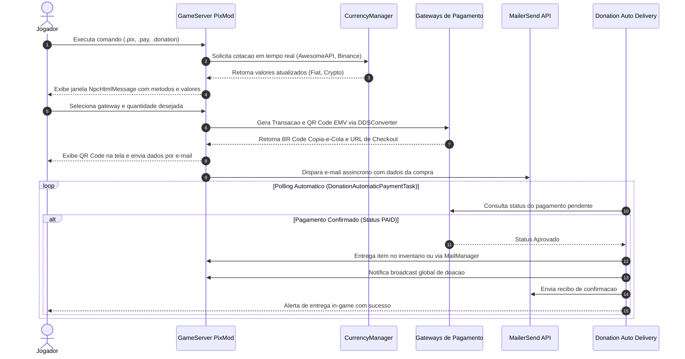
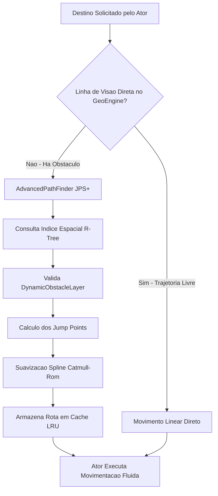

# ⚔️ Lineage2 NewEra — Next-Gen Lineage 2 Interlude (C6) Server Emulator

<p align="center">
  
  
  
  
  
  
  
  
  
  
</p>

---

## 📖 Visão Geral

O **Lineage2 NewEra** é um emulador de servidor de alta performance para **Lineage 2 Interlude (Chronicle 6)**, totalmente modernizado em **Java 25 + Kotlin 2.3.0-Beta2**.

Projetado com arquitetura modular multi-module Gradle, desacoplamento total via **SPI (Service Provider Interface)**, decomposição de entidades para eliminação de *god objects*, persistência multi-database com suporte **zero-config SQLite** e **MariaDB/PostgreSQL em produção**, proxy reverso Netty integrado com rate limiting por IP, observabilidade nativa com **Micrometer/Prometheus**, motor de persistência de latência ultrabaixa com **LMAX Disruptor (Cluster HPC)** e segurança endurecida.

> [!NOTE]
> Base histórica fundamentada nas comunidades **L2JBrasil** e **aCis**, totalmente refatorada através de ciclos contínuos de decomposição arquitetural, testes automatizados e hardening de produção.

---

## 📑 Índice de Navegação

1. [Arquitetura do Sistema & Diagramas](#-arquitetura-do-sistema--diagramas)
   - [Visão Geral do Ecossistema](#1-visão-geral-do-ecossistema)
   - [Camada de Rede e Proxy Netty](#2-camada-de-rede-e-proxy-netty)
   - [Ciclo de Vida de Extensões SPI](#3-ciclo-de-vida-de-extensões-spi)
   - [Decomposição Modular da Entidade Player](#4-decomposição-modular-da-entidade-player)
   - [Pipeline de Persistência HPC (LMAX Disruptor)](#5-pipeline-de-persistência-hpc-lmax-disruptor)
   - [Fluxo de Doação Assíncrona PixMod](#6-fluxo-de-doação-assíncrona-pixmod)
   - [Motor de Pathfinding Avançado & GeoEngine](#7-motor-de-pathfinding-avançado--geoengine)
2. [Módulos do Projeto Gradle](#-módulos-do-projeto-gradle)
3. [Catálogo Completo de Mods SPI (19 First-Party Mods)](#-catálogo-completo-de-mods-spi-19-first-party-mods)
4. [Sistemas Core de Gameplay & IA](#-sistemas-core-de-gameplay--ia)
   - [AutoFarm Inteligente](#autofarm-inteligente)
   - [Fake Players (Bots Autônomos)](#fake-players-bots-autônomos)
   - [GeoEngine & JPS+ PathFinder](#geoengine--jps-pathfinder)
   - [Community Board (BBS) & Buff Shop](#community-board-bbs--buff-shop)
   - [CountryLocaleManager & Multilíngue](#countrylocalemanager--multilíngue)
5. [Infraestrutura, Rede & Segurança](#-infraestrutura-rede--segurança)
   - [Reverse Proxy Netty (`:proxy`) & Defesa Fail2Ban](#reverse-proxy-netty-proxy--defesa-fail2ban)
   - [Fail2BanDashboard & Sincronização Atômica de Rotas](#fail2bandashboard--sincronização-atômica-de-rotas)
   - [Game API Interna (`:game-api`)](#game-api-interna-game-api)
   - [Cluster HPC & Telemetria Intel PCM (`:cluster-hpc`)](#cluster-hpc--telemetria-intel-pcm-cluster-hpc)
6. [Persistência & Multi-Database (Flyway)](#-persistência--multi-database-flyway)
7. [Observabilidade & Métricas Prometheus](#-observabilidade--métricas-prometheus)
8. [Segurança, Thread Safety & Qualidade](#-segurança-thread-safety--qualidade)
9. [Guia de Início Rápido (Quick Start)](#-guia-de-início-rápido-quick-start)
10. [Build & Opções de Compilação](#-build--opções-de-compilação)
11. [Execução (Host & Docker Compose)](#-execução-host--docker-compose)
12. [Matriz de Portas de Rede](#-matriz-de-portas-de-rede)
13. [Referência de Configuração](#-referência-de-configuração)
14. [Estrutura de Diretórios](#-estrutura-de-diretórios)
15. [Equipe, Comunidade & Licença](#-equipe-comunidade--licença)

---

## 🏛️ Arquitetura do Sistema & Diagramas

> O mapa investigativo mantido durante a modernização está em [`docs/architecture/system-map.md`](docs/architecture/system-map.md). Ele diferencia o que está integrado no runtime do que ainda é experimental ou planejado.
>
> A avaliação detalhada de Docker, MariaDB, PostgreSQL e acoplamento JDBC está em [`docs/architecture/database-decoupling-assessment.md`](docs/architecture/database-decoupling-assessment.md).

### 1. Visão Geral do Ecossistema

O Lineage2 NewEra adota uma arquitetura em camadas orientada a eventos e contratos SPI, permitindo desacoplamento total entre o núcleo do jogo, camada de rede, persistência e mods jogáveis:



---

### 2. Camada de Rede e Proxy Netty

O módulo `:proxy` atua como sentinela de borda isolando as instâncias do GameServer e LoginServer da internet direta:



---

### 3. Ciclo de Vida de Extensões SPI

Todos os 19 mods utilizam o contrato `br.project.spi.Extension` carregado dinamicamente via `java.util.ServiceLoader`:



---

### 4. Decomposição Modular da Entidade Player

A antiga God Class `Player.java` foi dividida em **57 classes de estado e componentes de domínio**, com delegação limpa e isolamento de responsabilidades:



---

### 5. Pipeline de Persistência HPC (LMAX Disruptor)

Persistência assíncrona de altíssima vazão sem contenção de locks sobre banco de dados:



---

### 6. Fluxo de Doação Assíncrona PixMod

Integração de múltiplos gateways de pagamento com cotação em tempo real e entrega não-bloqueante:



---

### 7. Motor de Pathfinding Avançado & GeoEngine

Algoritmo de Jump Point Search Plus (JPS+) em Kotlin com indexação espacial R-Tree e curvas Catmull-Rom:



---

## 📦 Módulos do Projeto Gradle

O repositório é organizado em **14 módulos Gradle desacoplados**:

| Módulo | Caminho | Descrição Técnica | Dependências Principais |
|---|---|---|---|
| `:commons` | `modules/commons` | Primitivas utilitárias, criptografia, BCrypt, connection pool e tipos de rede base. | Java 25, SLF4J |
| `:extensions-spi` | `modules/extensions-spi` | Contrato do SPI (`br.project.spi`), `ExtensionLoader`, `EventBus` e ciclo de vida de hooks. | `:commons` |
| `:game-enums` | `modules/game-enums` | Enums de domínio compartilhados extraídos do monólito (80+ enums de skills, combate, etc.). | `:commons` |
| `:game-model-api` | `modules/game-model-api` | Interfaces de modelos, records e contratos fundamentais de entidades. | `:game-enums`, `:commons` |
| `:game-network` | `modules/game-network` | Camada de conexão de rede, buffers MMO, pooling de buffers e decodificadores. | `:commons`, `:game-model-api` |
| `:game-packets` | `modules/game-packets` | Pacotes do protocolo cliente-servidor e login-game (Auth, SessionKey, Status). | `:game-network`, `:game-enums` |
| `:game-api` | `modules/game-api` | Servidor HTTP Netty interno no GameServer com autenticação HMAC-SHA256 e replay prevention. | `:commons`, `:game-model-api`, Kotlin |
| `:game-server-core` | `modules/game-server-core` | Núcleo completo do GameServer: World, GeoEngine, AI, Combat, Player decomposition e scripts. | Todos os sub-módulos acima, HikariCP, Netty, Zstd |
| `:login-server` | `modules/login-server` | Servidor de autenticação independente, gerenciamento de contas e proteção anti-bruteforce. | `:commons`, `:game-packets` |
| `:proxy` | `modules/proxy` | Processo Netty separado para proxy reverso TCP/HTTP com controle de Rate Limiting por IP. | Netty 4.2.16, SLF4J |
| `:cluster-hpc` | `modules/cluster-hpc` | Motor de latência ultrabaixa com LMAX Disruptor 4.0, SQLite WAL e telemetria Intel PCM. | Disruptor 4.0, SQLite JDBC, FlatBuffers |
| `:db-migrate` | `modules/db-migrate` | Runner de migração versionada de banco de dados baseado em Flyway. | Flyway Core, MariaDB, SQLite JDBC |
| `:app-dist` | `modules/app-dist` | Módulo empacotador de distribuição gerador do fat-jar (`libs/server.jar`). | Agrega `:game-server-core` + Mods |
| `:mods:*` | `modules/mods/*` | 19 sub-projetos Gradle contendo os mods first-party compilados como extensões SPI. | `:extensions-spi`, `:game-server-core` |

---

## 🧩 Catálogo Completo de Mods SPI (19 First-Party Mods)

Todos os mods são projetos Gradle independentes que podem ser incluídos ou excluídos via build flags:

| # | Módulo Gradle | Master Toggle / Config | Descrição & Funcionalidades |
|---|---|---|---|
| **1** | `:mod-agathion` | `ENABLE_AGATHION_MOD` | Companheiros Agathion com animações de summon, buffs passivos/ativos e teleports. |
| **2** | `:mod-battle-boss` | `ENABLE_BATTLE_BOSS` | Eventos periódicos de Boss com arena dedicada, contagem regressiva global e premiações. |
| **3** | `:mod-boss-zerg` | `ENABLE_BOSS_ZERG_PROTECTION` | Sistema anti-zerg em Grand Bosses; força flag PvP em participantes e equilibra dano. |
| **4** | `:mod-buff-shop` | `ENABLE_BUFF_SHOP` | Venda de buffs entre jogadores via lojas offline/online personalizadas por Adena ou Coin. |
| **5** | `:mod-capsule-box` | `ENABLE_CAPSULE_BOX` | Sistema de caixas de recompensa / gacha com animações visuais e probabilidades configuráveis. |
| **6** | `:mod-crypta` | `ENABLE_CRYPTA_MOD` | Camada de segurança e ofuscação de pacotes contra bots externos e adulteração de memória. |
| **7** | `:mod-dressme` | `ENABLE_DRESSME` | Customização cosmética de skins (armaduras, armas, capas, escudos, chapéus) sem alterar stats. |
| **8** | `:mod-dungeon` | `ENABLE_DUNGEON_SYSTEM` | Dungeons instanciadas estilo Kamaloka com restrição de grupo, limite de tempo e chefes XML. |
| **9** | `:mod-email` | `ENABLE_EMAIL_MOD` | Sistema de correio in-game com anexo de itens, devolução automática e proteção de entrega. |
| **10** | `:mod-fake-player` | `ENABLE_FAKE_PLAYERS` | Bots autônomos de IA que simulam jogadores reais (farm, chat, PvP em grupo, poções e equips). |
| **11** | `:mod-farm-event` | `ENABLE_FARM_EVENTS` | Eventos dinâmicos de invasão de mobs com drops especiais de evento e troca por NPCs. |
| **12** | `:mod-global-drop` | `ENABLE_GLOBAL_DROP` | Motor de injeção de drops globais por faixa de nível, raça de monstro ou região do mapa. |
| **13** | `:mod-levelup-maker` | `ENABLE_LEVELUP_MAKER` | Recompensas customizadas por marcos de nível, curvas de XP ajustadas e pacotes de boas-vindas. |
| **14** | `:mod-pix` | `ENABLE_PIX_MOD`<br/>`DONATION_ENABLED` | **PixMod (Dev A.L.N.)**: Gateway de doação multimoeda (PIX EMV, Mercado Pago, PayPal, Binance Crypto). |
| **15** | `:mod-player-god` | `ENABLE_PLAYER_GOD` | Sistema de deificação com aura de herói customizada, status de divindade e comandos especiais. |
| **16** | `:mod-roulette` | `ENABLE_ROULETTE` | Minigame de roleta da sorte com animação visual de giro, tiers de premiação e taxas em itens. |
| **17** | `:mod-safe-disconnect` | `ENABLE_SAFE_DISCONNECT` | Proteção contra combat-log (ALT+F4); mantém o personagem em combate pelo tempo configurado. |
| **18** | `:mod-summon-mob` | `ENABLE_SUMMON_MOB` | Ferramenta administrativa para invocação de ondas dinâmicas de monstros e bosses para eventos. |
| **19** | `:mod-tour` | `ENABLE_TOUR_SYSTEM` | Câmeras cinematográficas guiadas por pontos turísticos, cidades, castelos e áreas de raid. |

<details>
<summary><b>🔍 Detalhes Técnicos do PixMod (Dev A.L.N.)</b></summary>

O **PixMod** (`modules/mods/mod-pix`) é uma suíte de doação in-game de nível empresarial:
- **Gateways Suportados**:
  - **PIX (Mercado Pago)**: QR Code EMV / BR Code dinâmico gerado nativamente via `DDSConverter` com payload EMV.
  - **Mercado Pago Link**: Checkout web integrado suportando cartões e boletos.
  - **PayPal**: Integração via API de Orders/Invoices com suporte a Sandbox.
  - **Binance Pay / Crypto**: Recebimento em BTC, ETH, USDT, BNB com conversão automática fiat/cripto em tempo real via `CurrencyManager` (APIs AwesomeAPI e Binance Ticker).
- **Segurança**:
  - `CurrencyManager` recalcula todos os valores server-side (prevenção total de adulteração pelo cliente).
  - Rate limiting via `FloodProtector` em todos os bypasses de doação.
  - Validação de integridade de e-mail e conferência assíncrona por polling em background (`DonationAutomaticPaymentTask`).
- **Comandos**: `.pix` (interface em português), `.pay` (interface em inglês), `.donation` (geral).

</details>

---

## 🎮 Sistemas Core de Gameplay & IA

### AutoFarm Inteligente

O sistema de **AutoFarm** (`ext.mods.gameserver.model.entity.autofarm`) oferece automação de combate equilibrada e inteligente:
- **3 Modos Especializados**:
  - *Melee*: Perseguição com aproximação otimizada e rotação de skills de curta distância.
  - *Mage*: Manutenção de distância máxima de cast com rotação de magias e poções de MP.
  - *Archer*: Combate à distância com mecânica de **Kiting e Recuo Tático** (`handleArcherCombatPvp`) quando o alvo se aproxima.
- **Navegação Inteligente & Bypass de Obstáculos**: Integração com o GeoEngine para detectar bloqueios de linha de visão e calcular posições de contorno sem travar o personagem.
- **Perfis & Rotas**: Suporte a áreas circulares (Radius) ou rotas gravadas por Waypoints (Rota).
- **Controle de Vigor & Tempo**: Limites diários de tempo de uso configuráveis para evitar desbalanceamento econômico.

### Fake Players (Bots Autônomos)

O motor de **Fake Players** (`ext.mods.gameserver.model.entity.fakeplayer`):
- Cria instâncias completas de jogadores simulando comportamento humano real.
- Equipa armaduras e armas adequadas ao nível e classe do bot.
- Realiza rotações de caça em áreas de farm e participa de combates PvP/PK de forma orgânica.
- Suporta comandos de formação de grupos (party), uso de buffs e chat simulado.

### GeoEngine & JPS+ PathFinder

Escrito em **Kotlin** para extrair o máximo de desempenho do runtime da JVM:
- **Algoritmo JPS+ (Jump Point Search Plus)** com grade pré-computada para reduzir nós visitados em até 90% em relação ao A* tradicional.
- **Índice Espacial R-Tree** para localização instantânea de obstáculos e nós de malha.
- **Camada de Obstáculos Dinâmicos (`DynamicObstacleLayer`)** para portas abertas/fechadas, barricadas e muros de castelo destruídos.
- **Suavização Spline Catmull-Rom** eliminando movimentos em zigue-zague e proporcionando movimentação fluida.

### Community Board (BBS) & Buff Shop

- **BBS Avançado**: Painel in-game completo com ranking PvP/PK, estatísticas de clãs, loja com moedas customizadas, teleports, sistema de correio e buffer completo.
- **Sell Buff Engine**: Permite a qualquer personagem colocar suas skills de buff à venda em lojas autônomas mesmo estando desconectado (`Offline Store`).

### CountryLocaleManager & Multilíngue

- **Detecção de País por IP**: Na entrada do jogador (`EnterWorld`), consulta a API `ip-api.com` de forma assíncrona (com filtro imediato de IPs locais/privados).
- **Auto-Set de Idioma**: Configura automaticamente o locale do jogador para `pt-BR`, `en-US` ou `ru-RU`.
- **Tradução em Runtime DeepL**: Capacidade de tradução dinâmica de diálogos de NPCs e mensagens de sistema.

---

## 🛡️ Infraestrutura, Rede & Segurança

### Reverse Proxy Netty (`:proxy`) & Defesa Fail2Ban

Processo de borda autônomo e sentinela baseado em Netty 4.2 que deve ser exposto na borda da infraestrutura:
- **TCP Pass-through & Descarte Imediato**: Encaminhamento de pacotes brutos das portas públicas 7777 (Game) e 2106 (Login) para as portas internas isoladas (7778 e 2107). Descarte de conexões de IPs banidos em **~34,6 nanossegundos** ($O(1)$ em RAM via `ProxyBanCache`).
- **Notificação Instantânea IPC (<0.2ms)**: Canal de comunicação inter-processos via UDP Loopback (`127.0.0.1:19998`). Quando o `BanManager` do GameServer/LoginServer aciona um banimento, o `ProxyBanCache` recebe o push no mesmo milissegundo, eliminando janelas de vulnerabilidade do polling em disco.
- **Suporte a Cloudflare Tunnel (`cloudflared`)**: Sanitização e extração de IP real via `ClientIpExtractor` através dos cabeçalhos `CF-Connecting-IP`, `X-Forwarded-For` e `X-Real-IP` com **blindagem estrita anti-spoofing** (ignora headers caso a conexão direta não provenha de um proxy reverso confiável).
- **Suporte Nativo a IPv6**: Suporte integral a endereços IPv4 e IPv6, com bloqueio em lote de prefixos `/64` no modo `DEFENSIVE` do `PanicMode`.
- **HTTP Reverse Proxy (Porta 8090 / 80 / 443)**: Encaminha requisições HTTP para o backend web (Ktor / Game API) com auditoria de IP real e preservação de headers de proxy.
- **RateLimiter por IP**: Protege contra floods de conexão e requisições repetitivas (`maxConnections`, `maxRequests`, `windowSeconds`).
- **Homologação JMH**: Sustenta mais de **28,9 milhões de verificações por segundo** sob Java 25.
- **Configuração via XML**: `game/data/custom/mods/proxy.xml` e flags de isolamento em `server.properties` (`EnableNativeProxy`, `EnableFail2Ban`). Documentação técnica detalhada em [**`docs_api/architecture_proxy_fail2ban_flow.html`**](docs_api/architecture_proxy_fail2ban_flow.html) e [**`docs_api/architecture_proxy_fail2ban_flow.md`**](docs_api/architecture_proxy_fail2ban_flow.md).

### Fail2BanDashboard & Sincronização Atômica de Rotas

O subsistema de segurança conta com um painel administrativo Swing totalmente modernizado sob tema Cyberpunk Dark, com **zero emojis** (100% texto limpo para prevenir bugs de renderização de caixas pretas no Windows e terminais):

- **Dashboard Integrado com 5 Abas Nativas**:
  1. **`Active Bans`**: Monitoramento de banimentos ativos, geolocalização IP (País, Cidade, ISP) via `GeoLocationService`, tempo de expiração e desbloqueio manual seguro.
  2. **`Live Events`**: Stream de eventos de segurança reativo em tempo real via pub/sub com BanManager, histórico SQLite e exportação de auditoria em CSV.
  3. **`Proxy Logs`**: Terminal tailer ao vivo de logs do proxy Netty com pause/resume e auto-scroll.
  4. **`Proxy Routes`**: Inspeção visual das rotas de rede com identificação semântica automática do serviço de destino (`GameServer`, `LoginServer`, `Site Ktor`), filtro reativo em tempo real, alternância de estado de rota com 1 clique (`enabled="true"` / `false`) e botão de sincronização forçada de portas.
  5. **`XML Config`**: Editor monospaced embutido com proteção contra ataques XXE, validação sintática rigorosa pré-commit (SAX), backup automático `.bak` e escrita atômica `.tmp`.
- **Sincronização Atômica de IPs e Portas (Zero Port Conflicts)**:
  - O `proxy.xml` atua como fonte central da verdade para as portas públicas de escuta (`bindPort`) e portas internas dos serviços (`targetPort`).
  - Ao ligar o Proxy, salvar alterações no XML ou comutar rotas, o `SecurityConfigManager` sincroniza de forma atômica e simultânea:
    - `server.properties` (`GameserverPort = bindPort`, `GameServerInternalPort = targetPort`, `SiteBindPort = targetPort`, `KtorWebServerPort = targetPort`, `SiteBindHost = targetHost`, `KtorWebServerIp = targetHost`, `SiteWsPushPort = targetPort`).
    - `loginserver.properties` (`LoginserverPort = bindPort`, `LoginServerInternalPort = targetPort`).
    - Configurações em memória da JVM (`ConfigServer`, `ConfigLogin`) para garantir que os serviços façam bind nas portas corretas sem necessidade de reinício total do core.
- **Port Collision Guard (Anti-Colisão de Portas)**:
  - Validador pré-commit que impede que `bindPort == targetPort` em interfaces locais (`0.0.0.0`, `127.0.0.1`, `localhost`), prevenindo preventivamente falhas de inicialização com `java.net.BindException: Address already in use`.
- **Controle de Serviços na Barra de Governança**:
  - Toggles em tempo real para ativar/desativar o Fail2Ban e o Proxy Netty com sincronização automática e persistência nos arquivos de propriedades.

### Game API Interna (`:game-api`) & Portal de Integração

Serviço Netty HTTP interno de altíssima performance embutido no GameServer (porta padrão `9080` em `127.0.0.1`):
- **Princípio Zero-DB-Exposure**: O site Ktor, painéis externos ou Discord bots nunca conectam diretamente ao JDBC/banco de dados. Todas as mutações e consultas são processadas pela Game API.
- **Contrato Criptográfico HMAC-SHA256**: Validação estrita em 34 das 36 rotas via headers `X-Site-Timestamp`, `X-Site-Nonce` e `X-Site-Signature`. Assinatura canônica: `METHOD|path|timestamp|nonce|sha256Hex(body)`.
- **Prevenção de Replay Attack & Rate Limit**: Cache de nonces com expiração automática em janela de 5 min (`NonceCache`) e limitador de taxa por IP integrado.
- **Catálogo de 36+ Endpoints REST**:
  - **Autenticação & Contas**: `/internal/site/ping`, `/internal/site/register`, `/internal/site/login`, `/internal/site/account/change-password`, `/internal/site/account/player-reset`, `/internal/site/account/pk-reset`.
  - **Personagens & Itens**: `/internal/site/account/characters`, `/internal/site/account/rename`.
  - **Gestão de Clã & Aliança**: `clan/rename`, `rename-ally`, `level-up`, `level-down`, `transfer-leadership`, `members`, `ban-member`, `validate`.
  - **Guarda Real (Sub-Pledges)**: `royal-guard` (listagem, criação, renomeação, exclusão, transferência de membros e capitães).
  - **Guerras, Cercos & Skills**: `wars` (status, declaração, encerramento), `castle-siege` (listagem e registro), `invite` (candidatos e envio), `skills` (listagem, compra e doação de reputação) e `chat` (histórico e envio em tempo real com WebSocket push).
  - **Doações PIX, Loja & Votos**: `donation/config`, `donation/create` (QR Code PIX instantâneo), `donation/status`, `donation/history`, `donation/shop/buy` (compra de itens no shopping virtual com idempotência estrita via `idempotencyKey`), `vote/status`, `vote/intent`, `vote/intent/status` e `vote/deliver` (Top L2JBrasil).
  - **Rankings Públicos**: `/internal/site/rankings/{pvp|pk|clan}` (com cache em memória).
- **Documentação & Portal Interativo**:
  - 🌐 **Portal HTML Interativo com Tailwind CSS**: [**`docs_api/game_api_integration_guide.html`**](docs_api/game_api_integration_guide.html) (com busca instantânea, abas de payloads e snippets prontos em cURL, JavaScript, Kotlin e Python).

### Cluster HPC & Telemetria Intel PCM (`:cluster-hpc`)

Módulo de computação de alta performance e persistência sem bloqueios:
- **LMAX Disruptor 4.0**: RingBuffer lock-free para processamento de eventos de estado (`StateChangeEvent`).
- **Write-Behind Journaling**: Agrupa operações de escrita em lotes no SQLite WAL, reduzindo I/O em disco.
- **Intel Processor Counter Monitor (PCM)**: Monitoramento em nível de hardware de LLC (Last Level Cache) hits/misses, IPC (Instructions Per Cycle) e largura de banda de memória para detecção de stalls.

---

## 💾 Persistência & Multi-Database (Flyway)

O BrProject adota uma camada de abstração de dados compatível com múltiplos SGDBs através de `SqlDialect` e migrações versionadas com **Flyway**:

| Banco de Dados | Perfil de Uso | Configuração de Conexão (`server.properties`) |
|---|---|---|
| **SQLite (Padrão)** | **Zero-Config** (Dev, Testes, Offline) | `URL = jdbc:sqlite:data/brproject.sqlite`<br/>*Estado runtime local; schema e migrations ficam em `db/migrations/sqlite/`.* |
| **MariaDB 11+ / MySQL** | **Produção Recomendada** (Alta Concorrência) | `URL = jdbc:mariadb://localhost:3306/l2jdb?useUnicode=true&characterEncoding=UTF-8` |
| **PostgreSQL** | Produção Alternativa | `URL = jdbc:postgresql://localhost:5432/l2jdb` |
| **SQL Server** | Ambientes Corporativos | `URL = jdbc:sqlserver://localhost:1433;databaseName=l2jdb` |

> Os arquivos SQLite de runtime (`data/*.sqlite*`, `data/*.db*`), WAL/SHM, `hexid.txt`, logs e caches locais não são versionados. O arquivo `db/brproject.sqlite` é apenas o seed local versionado; em produção, use um banco externo e aplique as migrations.

### Executando Migrações Flyway

```bash
# Executar migração via runner dedicado :db-migrate
./gradlew :db-migrate:run --args="--url=jdbc:mariadb://localhost:3306/l2jdb --user=brproject --password=brproject"

# Ou utilizando o script helper
./tools/migrate-db.sh
```

---

## 📊 Observabilidade & Métricas Prometheus

O GameServer integra nativamente o **Micrometer 1.12.13**, expondo métricas no formato padrão **Prometheus** na porta `9090` (endpoint `/metrics`):

| Métrica Prometheus | Tipo | Descrição |
|---|---|---|
| `brproject.players.online` | Gauge | Quantidade de jogadores atualmente conectados no mundo |
| `brproject.logins.total` | Counter | Total acumulado de autenticações com sucesso desde o boot |
| `brproject.logins.per.minute` | Gauge | Taxa de logins por minuto (rolling window) |
| `brproject.packets.in` | Counter | Total de pacotes de rede recebidos dos clientes |
| `brproject.packets.out` | Counter | Total de pacotes de rede enviados aos clientes |
| `brproject.packets.errors` | Counter | Contagem de falhas de decodificação de pacotes |
| `brproject.npcs.active` | Gauge | NPCs e monstros com loop de IA ativo |
| `brproject.pvp.kills` | Counter | Total acumulado de abates PvP |
| `brproject.donations.processed` | Counter | Quantidade de transações de doação PixMod concluídas |

```bash
# Consultar métricas Prometheus localmente
curl http://localhost:9090/metrics
```

---

## 🔒 Segurança, Thread Safety & Qualidade

- **Autenticação Segura**: Senhas hasheadas com **BCrypt**, tokens gerados via `SecureRandom` criptográfico.
- **Proteção Anti-Bruteforce**: Banimento automático de IP configurável (`LoginTryBeforeBan=5`, `LoginBlockAfterBan=600`).
- **Sanitização de Input**: Restrição de nomes e templates por regex `[A-Za-z0-9_-]+`, bloqueando injeções de HTML/scripting.
- **12 Correções Críticas de Thread Safety**: Variáveis voláteis em barreiras de visibilidade de estado, coleções concorrentes (`ConcurrentHashMap`, `CopyOnWriteArrayList`), double-checked locking no GeoEngine e buffers seguros.
- **Análise Estática SpotBugs 6.5.9**: Integrada na esteira de CI com SARIF report para GitHub Code Scanning.
- **Suíte de Testes Unitários**: Mais de 130 testes cobrindo isolamento de estado do Player, SPI, cotação de moedas, pathfinding e autenticação.

---

## 🚀 Guia de Início Rápido (Quick Start)

### Pré-requisitos
- **JDK 25** (Eclipse Temurin 25 recomendado): `sdk install java 25.0.3-tem`
- **Gradle** (wrapper incluso no projeto)
- **Git**

### Passo a Passo

```bash
# 1. Clone o repositório
git clone https://github.com/seu-repo/BrProject-2026.git
cd BrProject-2026

# 2. Defina o Java 25 no ambiente
export JAVA_HOME=.../jdk-25 # Linux/macOS
# set JAVA_HOME=C:\path\to\jdk-25 # Windows

# 3. Compile o projeto e gere o fat-jar do servidor
./gradlew clean :app-dist:jar

# 4. Inicialize as configurações de exemplo
cp game/config/server.example.properties game/config/server.properties
cp login/config/loginserver.example.properties login/config/loginserver.properties

# 5. Inicie o LoginServer e o GameServer (Modo SQLite Zero-Config)
# Terminal 1 (LoginServer):
./gradlew :login-server:run

# Terminal 2 (GameServer):
./gradlew :game-server-core:run
```

---

## 🛠️ Build & Opções de Compilação

O `build.gradle.kts` disponibiliza flags de compilação customizáveis:

```bash
# Build completo com execução de testes unitários
./gradlew clean build

# Compilar apenas o núcleo (rápido)
./gradlew :game-server-core:compileKotlin :game-server-core:compileJava

# Gerar o binário final distribuível libs/server.jar
./gradlew :app-dist:jar

# Executar testes unitários
./gradlew test

# Executar análise estática de código SpotBugs
./gradlew spotbugsMain -Pspotbugs=true
```

### Flags de Propriedade do Gradle:

| Flag | Efeito |
|---|---|
| `-PwithoutMods=true` | Compila apenas o core do servidor, omitindo todos os 19 projetos `mod-*`. |
| `-PwithoutBossZerg=true` | Compila o servidor incluindo todos os mods, exceto o `mod-boss-zerg`. |
| `-Pspotbugs=true` | Força a execução das verificações estáticas de qualidade do SpotBugs. |

---

## 🐳 Execução (Host & Docker Compose)

### Executando em Host (Scripts Nativos)

Para o desenvolvimento local no Windows, use o launcher unificado. Ele inicia GameServer, LoginServer e Proxy em segundo plano, aguardando cada porta ficar pronta, e grava os logs em `logs/`:

```powershell
./StartL2NewEra.bat
```

| Serviço | macOS / Linux | Windows CMD / PowerShell |
|---|---|---|
| **Login Server** | `./StartLogin_SemDashboard.sh` | `StartLogin_SemDashboard.bat` |
| **Game Server** | `./StartGame_SemDashboard.sh` | `StartGame_SemDashboard.bat` |
| **Launcher / GUI** | `./StartBrproject.sh` | `StartBrproject.bat` |
| **Proxy Netty** | `./gradlew :proxy:run` | `gradlew.bat :proxy:run` |

### Executando com Docker Compose

A pasta `deploy/docker/` fornece a stack completa de microsserviços (`db` + `migrate` + `login` + `game` + `proxy`):

```bash
# 1. Copie o arquivo de variáveis de ambiente
cp .env.example .env

# 2. Suba toda a stack em background
docker compose -f deploy/docker/docker-compose.yml --env-file .env up -d --build

# 3. Acompanhe os logs do GameServer
docker compose -f deploy/docker/docker-compose.yml logs -f game
```

---

## 🌐 Matriz de Portas de Rede

O sistema opera em dois modos mutuamente exclusivos e auto-configuráveis: **Modo Standalone (Direto)** e **Modo Protegido por Proxy Reverso Nativo Netty**:

| Serviço | Porta Pública (Borda) | Porta Interna (Backend) | Protocolo | Modo Proxy Ativo | Modo Standalone (Direto) | Descrição |
|---|---|---|---|---|---|---|
| **GameServer** | `7777` | `7778` | TCP | `:proxy` escuta em `7777` e encaminha para `7778` | GameServer escuta diretamente em `7777` | Conexão de jogadores Lineage 2 Interlude com rate limiting e descarte $O(1)$ |
| **LoginServer** | `2106` | `2107` | TCP | `:proxy` escuta em `2106` e encaminha para `2107` | LoginServer escuta diretamente em `2106` | Autenticação, seleção de servidor e proteção anti-bruteforce |
| **Site Ktor** | `80` ou `443` | `8080` | HTTP/HTTPS | `:proxy` escuta em `80/443` e encaminha para `8080` | Site escuta diretamente em `8080` (ou atrás do Cloudflare Tunnel) | Portal Web Ktor, rankings, chat em tempo real e checkout PIX |
| **Game API** | *Não Exposta* | `9080` | HTTP (Loopback) | Apenas escuta interna em `127.0.0.1` | Apenas escuta interna em `127.0.0.1` | API Netty HTTP restrita com autenticação criptográfica HMAC-SHA256 |
| **Fail2Ban IPC** | *Não Exposta* | `19998` | UDP (Loopback) | Push instantâneo (<0.2ms) Game/Login para Proxy | Push desativado se proxy desligado | Notificação de banimentos inter-processos com latência sub-milissegundo |
| **Prometheus Metrics** | `9090` | `9090` | HTTP | Telemetria e métricas operacionais | Telemetria e métricas operacionais | Endpoint `/metrics` para monitoramento contínuo |
| **MariaDB** | `3306` | `3306` | TCP | Banco de dados relacional em produção | Banco de dados relacional em produção | Persistência externa (quando não utilizado o SQLite zero-config) |

---

## ⚙️ Referência de Configuração

Os arquivos de propriedades principais localizam-se em `game/config/` e `login/config/`:

<details>
<summary><b>📂 Tabela de Arquivos de Configuração (.properties)</b></summary>

| Arquivo | Domínio de Configuração |
|---|---|
| `server.properties` | Endereços de IP, portas, limites de conexões, pool de banco de dados e observabilidade. |
| `rates.properties` | Multiplicadores de taxas: XP, SP, Adena, Drop de Itens, Spoil, Quest Rewards. |
| `players.properties` | Parâmetros de jogadores: limites de peso, inventário, buffs, penalidades e sub-classes. |
| `npcs.properties` | Comportamento de NPCs, inteligência artificial de monstros e drops. |
| `events.properties` | Configurações de eventos automatizados (TvT, DM, CTF, Last Man Standing). |
| `geoengine.properties` | Configurações do motor GeoData, malhas 3D e algoritmos de Pathfinding. |
| `mods.properties` | Master toggles de ativação e parâmetros dos mods first-party. |
| `protection.properties` | Proteção contra múltiplos clientes por HWID e anti-cheat. |
| `bosszerg.properties` | Parâmetros de proteção anti-zerg em arenas de Grand Boss. |
| `kamaloka.properties` | Dungeons instanciadas, tempos de cooldown e número de membros por grupo. |
| `offlineshop.properties` | Sistema de lojas e buff stores offline de jogadores. |
| `items.properties` | Taxas de enchant, limites seguros, quebra de itens e sistema de crafting. |
| `clans.properties` | Níveis de clã, reputação, penalidades de saída e membros por subclã. |
| `siege.properties` | Horários de sieges, guardas de castelo e controle de portas. |
| `donation.properties` | Configuração detalhada do PixMod (tokens MP, PayPal, chaves Binance, e-mail). |
| `language.properties` | Idiomas habilitados e integração com geolocalização de IP. |

</details>

---

## 🗂️ Estrutura de Diretórios

```text
BrProject-2026/
├── modules/                         # Sub-projetos Gradle
│   ├── commons/                     # Utilitários, criptografia, logging e rede base
│   ├── extensions-spi/              # Contratos de SPI, ExtensionLoader e EventBus
│   ├── game-enums/                  # Enums de domínio (skills, combat, actor types)
│   ├── game-model-api/              # Modelos, records e interfaces públicas
│   ├── game-network/                # Netty MMO network pipeline & selectors
│   ├── game-packets/                # Pacotes cliente-servidor e login-game
│   ├── game-api/                    # Netty HTTP API interna com HMAC-SHA256
│   ├── game-server-core/            # Núcleo do GameServer, GeoEngine, AI, World
│   ├── login-server/                # Servidor de Login, Auth, SessionKey
│   ├── proxy/                       # Proxy reverso Netty TCP/HTTP com RateLimiter
│   ├── cluster-hpc/                 # LMAX Disruptor 4.0, SQLite WAL & Intel PCM
│   ├── db-migrate/                  # Runner de migrações Flyway
│   ├── app-dist/                    # Distribuição / montagem do libs/server.jar
│   └── mods/                        # 19 First-Party Mods desacoplados (mod-*)
├── brproject-data/                  # Schemas versionados, migrations e config-examples
├── deploy/                          # Dockerfiles e docker-compose.yml
├── game/                            # Raiz de execução do GameServer (data/ e config/)
├── login/                           # Raiz de execução do LoginServer (config/)
├── tools/                           # Scripts de migração, sync e setup
├── docs/                            # Documentação técnica, ADRs e guias de arquitetura
├── build.gradle.kts                 # Orquestração do build multi-module
└── settings.gradle.kts              # Declaração dos 14 módulos e 19 mods
```

---

## 👥 Equipe, Comunidade & Licença

### Core Team
- **Dhousefe-L2JBR**
- **Agazes33**
- **Ban-L2jDev**
- **Warman**
- **SrEli**
- **Dev A.L.N.** *(Autor do PixMod)*

### Colaboradores & Agradecimentos
Nattan Felipe, Diego Fonseca, Junin, ColdPlay, Denky, MecBew, Eduardo.SilvaL2J, biLL, xpower, xTech, kakuzo, Tiagorosendo, Schuster, LucasStark, damedd.

### Comunidade
- **Website & Fórum:** [L2JBrasil.com](https://l2jbrasil.com)
- **Versão:** 3.1.0 (Build 2026)

### Licença
Este projeto é distribuído sob a licença **GNU General Public License v3.0** — consulte o arquivo [LICENSE](LICENSE) para mais detalhes.
