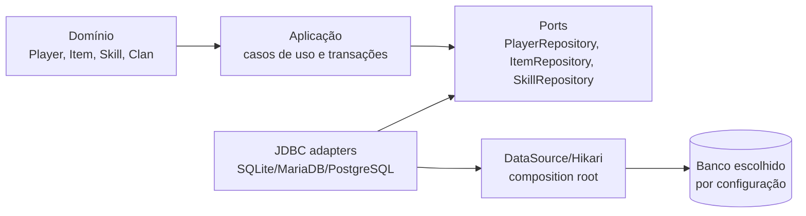

# Estudo de banco, Docker e desacoplamento de persistência

Status: estudo técnico; nenhuma mudança de runtime foi feita nesta branch.

Base analisada: `main` em `76bfd4a1`, após o merge da documentação arquitetural.

## Resumo executivo

O projeto possui uma tentativa real de suportar vários bancos, migrações Flyway e execução com Docker. Porém, essas três partes ainda não formam um caminho operacional único:

1. O caminho local confirmado usa SQLite runtime.
2. As configurações e migrations de produção estão orientadas a MariaDB.
3. PostgreSQL aparece no resolver JDBC e na configuração, mas ainda não possui migrations próprias nem garantia de compatibilidade.
4. O Compose atual não sobe o MariaDB descrito no README; ele aponta GameServer e LoginServer para um SQLite compartilhado e não declara os serviços `db` e `migrate`.
5. A aplicação possui um pool JDBC centralizado, mas não possui uma camada de repositories injetáveis abrangendo o domínio.

Conclusão: trocar a URL para PostgreSQL agora seria apenas trocar o ponto de falha. Primeiro precisamos tornar o caminho de persistência explícito e testável.

## O que existe hoje

### Docker

Arquivos existentes:

- `deploy/docker/docker-compose.yml`;
- `deploy/docker/Dockerfile.game`;
- `deploy/docker/Dockerfile.login`;
- `deploy/docker/Dockerfile.service`;
- `deploy/docker/Dockerfile.jlink`;
- scripts `run-game.sh` e `run-login.sh`;
- `deploy/docker/README.md`;
- `brproject-data/config-examples/*docker.example`.

### Inconsistências encontradas

| Item | README/configuração esperada | Compose atual | Impacto |
|---|---|---|---|
| Banco | MariaDB 11 e Flyway | SQLite em volume compartilhado | O fluxo documentado não é o fluxo executado. |
| Serviço `db` | Descrito como existente | Não declarado no Compose | `depends_on` e host `db` não funcionam como documentado. |
| Serviço `migrate` | Descrito como existente | Não declarado no Compose | O schema não é aplicado automaticamente pela stack. |
| Variáveis | `MYSQL_*`, `DB_URL` MariaDB | `DB_URL` SQLite dentro dos containers | Variáveis do `.env` não controlam a conexão real do Compose. |
| `DB_MODE` | `READ_ONLY_POOL`/`SINGLE_WRITER` no Compose | Não encontrado no caminho principal do GameServer | Parece configuração de um desenho experimental, não uma configuração efetiva. |
| Site | `site-service` | Não existe módulo `site` no Gradle atual | Serviço não é reproduzível a partir deste checkout. |
| API gateway | Classe no `cluster-hpc` | Imagem/jar não é produzido pelo fluxo padrão | Depende de build e wiring que não estão garantidos. |
| Logs | README usa `logs -f login game` | Nomes declarados são `login-server` e `game-server` | Comando documentado não corresponde aos nomes atuais. |

Isso não significa que a ideia seja inútil; significa que `deploy/docker` deve ser tratado como um protótipo de deployment que precisa de uma feature própria de hardening antes de ser usado como ambiente oficial.

## Acoplamento medido

Busca estática no checkout analisado encontrou aproximadamente:

| Indicador | Quantidade | Leitura |
|---|---:|---|
| Arquivos com `ConnectionPool.getConnection()` | 115 | O pool é usado diretamente por managers, tabelas, entidades, handlers e GUI. |
| Arquivos Game/Login com `prepareStatement` ou `createStatement` | 102 | SQL está espalhado por múltiplos contextos. |
| Arquivos Game/Login relacionados a JDBC | 108 | O limite da infraestrutura não está concentrado em um módulo. |
| Arquivos com `DriverManager` em Game/Login/Proxy | 5 | Existem caminhos fora do pool principal. |
| Helpers de JDBC reutilizáveis | 1 (`JdbcSupport`) | Existe uma semente de abstração, mas ela ainda chama o singleton global. |

O resultado é uma abstração de conexão, não uma abstração de persistência. `ConnectionPool` injeta credenciais e escolhe o driver, mas as regras de aplicação continuam conhecendo SQL, tabelas e `Connection`.

## Limites atuais do suporte a bancos

### `ConnectionPool`

O pool usa HikariCP e detecta o banco pelo prefixo JDBC. Para SQLite força pool pequeno e ativa WAL. Para outros bancos usa o pool padrão.

Isso é útil como infraestrutura, mas não é injeção de repository. A maioria das classes ainda chama `ConnectionPool.getConnection()` estaticamente.

### `SqlDialect`

O adaptador atual faz poucas conversões quando o banco ativo é SQLite:

- `ON DUPLICATE KEY UPDATE` → `INSERT OR REPLACE`;
- `TRUNCATE` → `DELETE`.

Para PostgreSQL ele não traduz SQL MariaDB. Portanto, o projeto não possui hoje uma camada de dialeto PostgreSQL completa.

### Migrations

Existem diretórios `mariadb/` e `sqlite/`. O runner direciona PostgreSQL para o diretório MariaDB, alegando compatibilidade. Essa suposição não é segura porque o baseline MariaDB contém sintaxe como backticks, tipos unsigned e convenções específicas de MariaDB.

A estratégia correta para PostgreSQL é criar `migrations/postgresql/` com schema próprio e validar todas as migrations em banco real.

## Arquitetura-alvo de persistência



Regras:

- domínio não importa `java.sql`, Hikari, Netty ou XML;
- casos de uso dependem de interfaces, não do banco;
- adapters implementam as interfaces e concentram SQL;
- a escolha SQLite/MariaDB/PostgreSQL ocorre no bootstrap;
- transações pertencem ao caso de uso/repository unit of work, não a entidades.

## Estratégia de migração sem quebrar a versão jogável

### Fase A — tornar Docker honesto

Corrigir somente o deployment, sem trocar o domínio:

1. escolher MariaDB como primeiro backend containerizado, pois já existe schema principal para ele;
2. declarar `db` com imagem oficial MariaDB;
3. declarar `migrate` como job Flyway;
4. fazer GameServer e LoginServer usarem `jdbc:mariadb://db:3306/...`;
5. corrigir nomes de serviços, healthchecks, volumes, credenciais e logs;
6. validar login, criação de personagem, relogin e shutdown.

Estimativa: **pequena/média**, aproximadamente uma feature de deployment. Risco baixo para o código do jogo, mas alto se o Compose continuar misturando SQLite, MariaDB e o protótipo HPC.

### Fase B — criar portas de persistência

Começar por um único fluxo vertical, sem mover `Player` inteiro:

```text
PlayerPersistence atual
        ↓ delegação gradual
PlayerRepository / PlayerStateRepository
        ↓
JdbcPlayerRepository
```

Primeiro alvo recomendado: salvar/carregar dados básicos do personagem, porque está diretamente relacionado ao rollback observado. Depois seguir para skills, inventário, subclass e quests.

Cada extração deve conter:

- interface do repository;
- implementação JDBC equivalente ao comportamento atual;
- teste de integração com banco;
- métrica de duração e falha;
- fallback temporário para o caminho antigo somente se necessário.

Estimativa: **média/alta**, várias features verticais. Não é uma alteração de uma única classe.

### Fase C — PostgreSQL

Só depois de existir um caminho JDBC testado:

1. criar migrations PostgreSQL próprias;
2. validar tipos, chaves, índices, defaults e concorrência;
3. revisar SQL incompatível;
4. adicionar driver e profile de build/runtime;
5. importar um banco SQLite/MariaDB de teste;
6. executar testes de login, personagem, inventário, skills, comércio, clãs, quests, olimpíadas e offline trade;
7. fazer teste de carga e recuperação.

Estimativa: **alta**. O volume de SQL e tabelas é grande; a dificuldade principal não é o driver, mas semântica de schema, transações e consultas espalhadas.

## O que pode ser feito com baixo risco

- corrigir e testar o Compose isoladamente;
- adicionar healthchecks e scripts de inicialização;
- criar repositories novos sem remover os antigos;
- extrair um caso de uso por vez;
- centralizar métricas de SQL;
- criar migrations PostgreSQL sem alterar SQLite/MariaDB;
- adicionar testes de contrato para cada repository;
- manter a versão 1.0 jogável enquanto a versão 2.0 reorganiza a arquitetura.

## O que não deve ser feito ainda

- substituir todas as chamadas JDBC de uma vez;
- mover todas as entidades para um novo módulo;
- ativar o `cluster-hpc` como banco principal sem cobertura completa;
- confiar que o schema MariaDB funciona em PostgreSQL;
- usar o Compose atual como prova de produção;
- misturar migração de banco, refatoração do domínio e mudanças de gameplay no mesmo PR.

## Decisão recomendada

Para a versão 1.0:

```text
Local simples: SQLite
Homologação containerizada: MariaDB via Docker
Produção inicial: MariaDB ou PostgreSQL após teste de compatibilidade
```

Se a decisão estratégica for PostgreSQL desde a primeira produção, ele deve receber uma implementação própria de migrations e testes antes de ser escolhido. O projeto não está pronto hoje para afirmar que PostgreSQL é apenas uma troca de configuração.

Para a versão 2.0, a ordem mais segura é:

```text
ConnectionPool como composition root
→ repositories por domínio
→ casos de uso
→ adapters de banco
→ migrations por vendor
→ remoção gradual do SQL das entidades/managers
```
