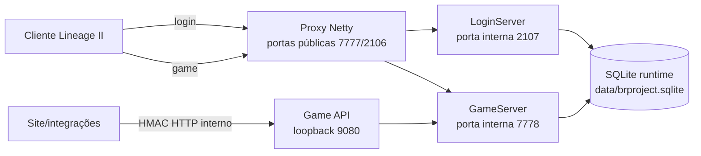
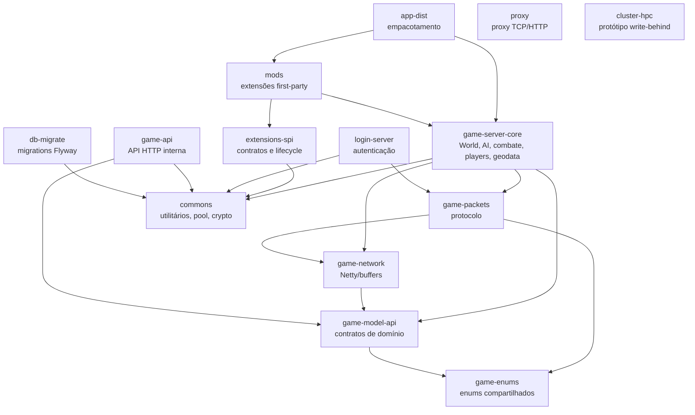
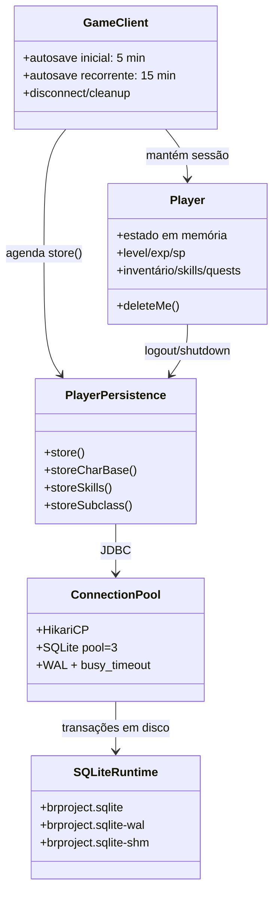
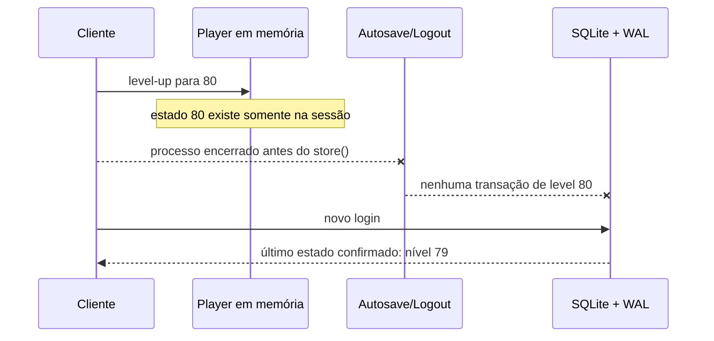
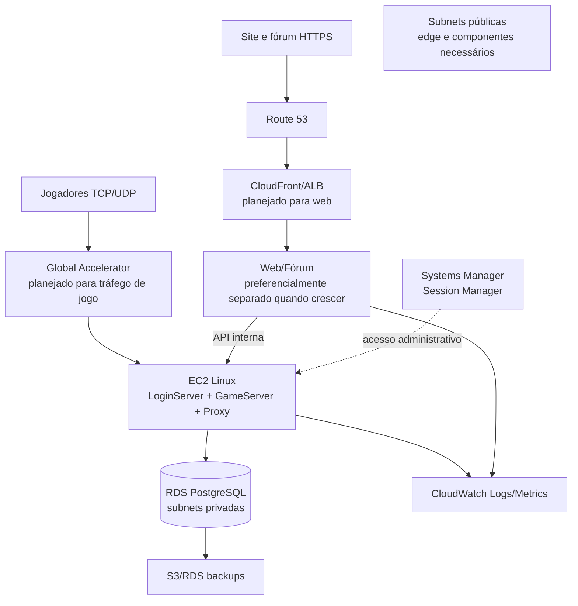

# Mapa arquitetural — L2 NewEra

Status: baseline investigativo, atualizado em 2026-09-24.

Este documento descreve o que foi confirmado no código atual. Propostas futuras estão marcadas como **planejado** e não devem ser interpretadas como funcionalidades já integradas.

## 1. Visão de execução atual

O proxy é um processo separado. O launcher local expõe as portas públicas e encaminha para as portas internas dos servidores. A Game API é interna e não deve ser confundida com acesso direto do site ao banco.

## 2. Organização dos módulos

### Módulos principais

| Área | Módulos | Responsabilidade |
|---|---|---|
| Base | `commons`, `game-enums`, `game-model-api` | Tipos compartilhados, utilitários e contratos de domínio. |
| Protocolo | `game-network`, `game-packets` | Transporte Netty, buffers e pacotes do cliente. |
| Servidores | `login-server`, `game-server-core`, `proxy` | Login, mundo/jogabilidade e borda de rede. |
| Integração | `game-api`, `extensions-spi`, `mods` | API interna, extensões e funcionalidades opcionais. |
| Distribuição | `app-dist`, `db-migrate` | Empacotamento e migrações. |
| Experimental | `cluster-hpc`, `benchmarks-network` | Protótipos e benchmarks; não presumir integração no runtime. |

## 3. Composição do jogador e persistência

### O que WAL e SHM significam

- `brproject.sqlite` é o banco persistente local.
- `brproject.sqlite-wal` é o write-ahead log em disco das transações recentes.
- `brproject.sqlite-shm` é um arquivo auxiliar de coordenação/índice do modo WAL.
- Eles não formam um banco temporário separado em memória.
- Uma mudança só pode ser recuperada depois de reinício se tiver sido efetivamente confirmada pelo SQLite. Dados que permaneciam somente no objeto `Player` não podem ser recuperados pelo WAL.

## 4. Explicação do rollback observado

O código atual agenda o primeiro autosave em 300.000 ms e os seguintes em 900.000 ms. O desligamento normal também salva jogadores, mas um encerramento forçado, queda de energia ou kill do processo pode interromper esse caminho.

### Próxima investigação recomendada

1. Logar `characterId`, nível em memória, nível lido do banco, início/fim e exceção de cada `store()`.
2. Confirmar se level-up, troca de classe e subclass chamam `store()` imediatamente.
3. Adicionar um teste de recuperação: 79 → 80 → restart gracioso e forçado → login.
4. Fazer o launcher esperar o encerramento completo dos processos.
5. Evitar salvar cada movimento/ataque; preferir eventos importantes e autosave confiável.

## 5. Divergência entre documentação e integração real

O README descreve `cluster-hpc` como pipeline de persistência write-behind ativo. A auditoria atual encontrou o módulo e seus testes/protótipos, mas não encontrou seu wiring no caminho de inicialização do GameServer. O runtime confirmado usa `GameClient` → `PlayerPersistence` → `ConnectionPool`.

Essa divergência deve ser resolvida em uma feature futura: ou integrar o write-behind com cobertura completa das entidades, ou ajustar a documentação para apresentá-lo apenas como experimental.

## 6. Arquitetura de produção proposta

### Princípios

- Banco sem IP público; somente o security group da aplicação pode acessá-lo.
- Uma EC2 única para jogo, login e site é aceitável no primeiro ambiente, mas deve ter processos, limites e deploys separados.
- Para aproximadamente 250 jogadores, o tamanho da EC2 deve ser escolhido por teste de carga com bots e cenários de cidade/PvP, não por estimativa.
- PostgreSQL é uma boa meta de produção, mas a migração exige revisar SQL específico de SQLite, schema, migrations e testes de integração.
- Session Manager é preferível a manter SSH público; bastion só deve ser criado se houver uma necessidade operacional concreta.
- Shield Standard é a camada básica. Para ataques relevantes contra TCP/UDP, estudar Global Accelerator e Shield Advanced; WAF protege a superfície web, não substitui proteção do protocolo do jogo.

## 7. Fontes AWS para o estudo

- [EC2 compute optimized](https://docs.aws.amazon.com/ec2/latest/instancetypes/co.html)
- [Escolha e medição de instância EC2](https://docs.aws.amazon.com/AWSEC2/latest/UserGuide/instance-discovery.html)
- [Amazon RDS](https://docs.aws.amazon.com/AmazonRDS/latest/UserGuide/)
- [VPC e security groups](https://docs.aws.amazon.com/vpc/latest/userguide/vpc-security-groups.html)
- [Systems Manager Session Manager](https://docs.aws.amazon.com/systems-manager/latest/userguide/session-manager.html)
- [CloudWatch Agent](https://docs.aws.amazon.com/AWSEC2/latest/UserGuide/monitoring-scripts-intro.html)
- [Shield e aplicações TCP/UDP](https://docs.aws.amazon.com/waf/latest/developerguide/ddos-resiliency-example-tcp-udp.html)
